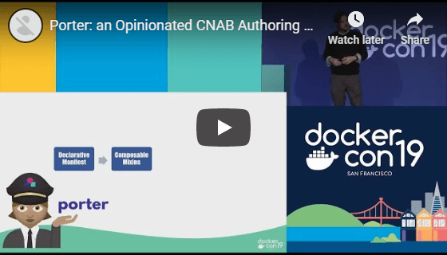

# Azure CNAB Quickstarts

This repository contains [CNAB](https://cnab.io/) quickstart solutions for deploying applications to Azure.

We currently support application bundles built using [Porter](https://porter.sh).

The following videos are good resources for getting started with learning about CNAB and Porter:

## Porter: an Opionated CNAB Authoring Experience - from [@jeremyrickard](https://github.com/jeremyrickard)

## GitOps at the edge of the envelope: Radical app deployment at the edge with Porter - from [@squillace](https://github.com/squillace)

# Repository Structure

- `.github` - Contains GitHub repo related files, such as issue templates and GitHub Actions workflow definitions
- `docs` - Overview documentation for Azure CNAB Quickstarts
- `images` - Images used in readme and documentation
- `porter` - Contains Porter-based quickstarts (currently only supported tool for quickstarts). Each quickstart is contained within its own sub-directory.
- `porter-template` - Template files for building a new Porter-based quickstart (see [Authoring Quickstarts](./docs/authoring.md))

# Quickstarts Table of Contents

A list of all available Porter-based quickstarts can be found [here](porter/TOC.md).

# Consuming quickstarts

For more information about consuming quickstarts, see [this guide](./docs/consuming.md).

# Authoring quickstarts

For more information about authoring quickstarts, see [this guide](./docs/authoring.md).

# Contributing

This project welcomes contributions and suggestions.  Most contributions require you to agree to a
Contributor License Agreement (CLA) declaring that you have the right to, and actually do, grant us
the rights to use your contribution. For details, visit https://cla.microsoft.com.

When you submit a pull request, a CLA-bot will automatically determine whether you need to provide
a CLA and decorate the PR appropriately (e.g., label, comment). Simply follow the instructions
provided by the bot. You will only need to do this once across all repos using our CLA.

This project has adopted the [Microsoft Open Source Code of Conduct](https://opensource.microsoft.com/codeofconduct/).
For more information see the [Code of Conduct FAQ](https://opensource.microsoft.com/codeofconduct/faq/) or
contact [opencode@microsoft.com](mailto:opencode@microsoft.com) with any additional questions or comments.
