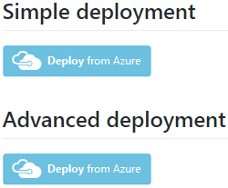
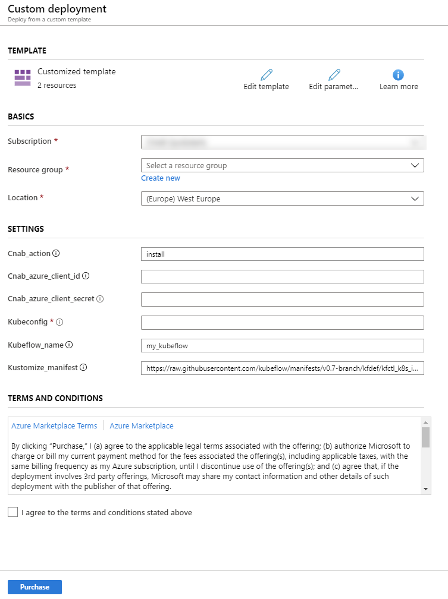
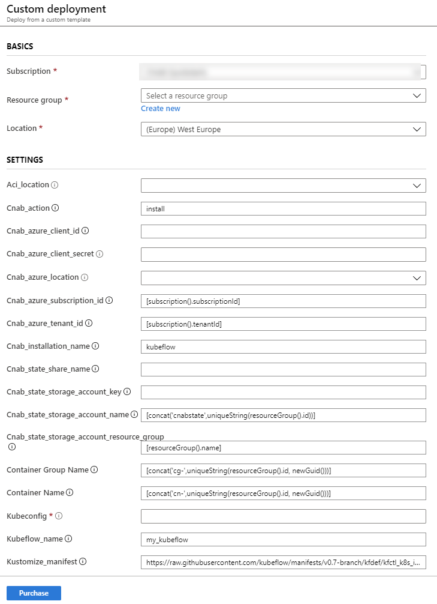
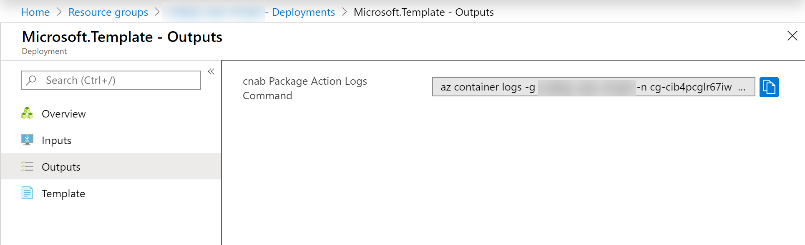

# Consuming Quickstarts

Each bundle produced from this repository is published to a public Azure Container Registry (ACR) at cnabquickstarts.azurecr.io.

There are several ways to consume these bundles, using any CNAB-compliant tool (such as [Duffle](https://duffle.sh/), [Porter](https://porter.sh/), or [Docker App](https://www.docker.com/products/docker-app)).

Here we list 2 different ways of installing bundles, using either Porter in Azure Cloud Shell or via the 'Deploy from Azure' button that is included on the readme page of each quickstart.

## Deploy from Cloud Shell

CNAB Quickstarts can be installed from [Azure Cloud Shell](https://azure.microsoft.com/en-gb/features/cloud-shell/).

To setup Porter and the [CNAB Azure Driver](https://github.com/deislabs/cnab-azure-driver) in Cloud Shell, run the following command:

```
curl https://raw.githubusercontent.com/deislabs/cnab-azure-driver/master/install-in-azure-cloudshell.sh |/bin/bash
source .bashrc
```

The CNAB Azure Driver allows Porter to install bundles using Azure Container Instances as the driver.

Once setup is complete, you can install Quickstarts by using the following steps:

### 1. View bundle credentials/parameters

You can view details about the bundle, including any credentials and parameters required, by running the following command.

```
porter explain --tag cnabquickstarts.azurecr.io/porter/<quickstart-name>/bundle:<quickstart-version>
```

e.g.

```
porter explain --tag cnabquickstarts.azurecr.io/porter/aks-aad-oauth-proxy/bundle:0.1.0
```

### 2. Set up credentials, if required

If the bundle requires credentials, you must generate a credentials file with the required values.

```
porter credentials generate --tag cnabquickstarts.azurecr.io/porter/<quickstart-name>/bundle:<quickstart-version>
```

e.g.

```
porter credentials generate --tag cnabquickstarts.azurecr.io/porter/aks-aad-oauth-proxy/bundle:0.1.0
```

This will output the path to the credentials file generated.

### 3. Run the install command

This command uses Porter with the CNAB Azure Driver. By default, the driver will use your Azure account for authentication, although this can be overridden to use a different Azure account. 

The account must, at a minimum, have permission to create resource groups and create Azure Container Instance (ACI) resources, plus permission for creating any resources defined in the specific bundle you are installing. 

More information about the requirements and configuration for the CNAB Azure Driver can be found over on the [GitHub repo](https://github.com/deislabs/cnab-azure-driver).

```
porter install --tag cnabquickstarts.azurecr.io/porter/<quickstart-name>:<quickstart-version> --cred <path-to-creds-file> -d azure --param <param1>=<param1value> --param <param2>=<param2value> ...
```

```
porter install --tag cnabquickstarts.azurecr.io/porter/aks-aad-oauth-proxy:0.1.0 --cred aks-aad-oauth-proxy -d azure --param aad_application_name=myapp --param aad_application_secret=53cret! --param fqdn=myapp.microsoft.com
```

Please note that it may take a few minutes for the ACI boostrapper to start up before the installer runs.

## Deploy from Azure

Another option for deploying the quickstart bundles is to use the 'Deploy from Azure' buttons that are included on the readme page for each quickstart.

Currently, in order to use this option, you will need to create a service principal with permissions to create resources in your target Azure subscription. You can do this via the Azure CLI with the following command:

```
az ad sp create-for-rbac -n <name-of-service-principal>
```

The output from this command will show the app ID (also known as client ID) and password (also known as secret) for the service principal - note these down for later.

On each readme, you will see two buttons like this:



Both options create a custom deployment in Azure, which will create an Azure Container Instance (ACI) group and create a container instance in that group for running a bootstrapper image, which in turn will create a container instance that runs the invocation image for the bundle. Please note that it may take a few minutes for the ACI boostrapper to start up.

The 'Simple deployment' and 'Advanced deployment' only differ in the number of settings available to configure.

### Simple deployment

The 'Simple deployment' infers as many settings as possible, leaving the minimum number of settings for the user to fill.

When clicking the button, you will be presented with a page like this in the Azure Portal:



Every deployment will have the following settings:

| Setting | Description |
|---|---|
| Cnab_action | The bundle action to invoke (e.g. install, upgrade, uninstall) |
| Cnab_azure_client_id | The client ID (also known as app ID) for the service principal used to create the ACI for the invocation image |
| Cnab_azure_client_secret | The client secret (also known as password) for the service principal used to create the ACI for the invocation image |

In addition to these, any credentials & parameters from the bundle itself will be displayed as settings (`Kubeconfig`, `Kubeflow_name`, and `Kustomize_manifest` in the example above).

If any of the bundle credentials/parameters are file-based, the corresponding setting will accept a base64 string representation of the file (`Kubeconfig` is one such setting in the example above).

You can get the base64 representation of a file using the following:

Windows PowerShell - `[Convert]::ToBase64String([System.Text.Encoding]::Utf8.GetBytes($(gc <path-to-file>)))`

Linux Bash - `cat <path-to-file> | base64`

Additionally, with the 'Simple deployment' option, any of the following credentials/parameters from the bundle will be inferred and not presented as settings:

| Credential/parameter | Inferred value |
| --- | --- |
| azure_client_id | Cnab_azure_client_id setting value |
| azure_client_secret | Cnab_azure_client_secret setting value |
| azure_location | Deployment resource group location |
| azure_subscription_id | Deployment subscription ID |
| azure_tenant_id | Deployment tenant ID |


### Advanced deployment

The 'Advanced deployment' option is similar, except no parameters are inferred, so it provides the user with more customization.

When clicking the button you will be presented with a page like this in the Azure Portal:



Every deployment will have the following full set of settings:

| Setting | Description |
|---|---|
| Aci_location | The Azure location for creating the ACI for the bootstrapper container |
| Cnab_action | The bundle action to invoke (e.g. install, upgrade, uninstall) |
| Cnab_azure_client_id | The client ID (also known as app ID) for the service principal used to create the ACI for the invocation image |
| Cnab_azure_client_secret | The client secret (also known as password) for the service principal used to create the ACI for the invocation image |
| Cnab_azure_location | The Azure location for creating the ACI for the invocation image container |
| Cnab_azure_subscription_id | The Azure subscription in which to create the ACI for the invocation image container |
| Cnab_azure_tenant_id | The Azure tenant to use for authenticating the service principal |
| Cnab_installation_name | The installation name to use for the bundle instance |
| Cnab_state_share_name | The Azure File Share name in the storage account for the CNAB state to be stored in |
| Cnab_state_storage_account_name | The name for the Azure storage account for the CNAB state to be stored in, by default this will be created if it does not exist |
| Cnab_state_storage_account_key | The key for the Azure storage account for the CNAB state to be stored in. If this is left blank, it will be looked up at runtime |
| Cnab_state_storage_account_resource_group | The resource group name for the storage account for the CNAB state to be stored in, by default this will be in the deployment resource group. If this is changed to a different resource group, then the storage account is expected to already exist |
| Container Group Name | The name for the Azure Container Instance Group |
| Container Name | The name for the Azure Container Instance |

### Running the deployment

Once the parameters are filled in, accept the terms and conditions checkbox and select 'Purchase'. This will start the deployment of the bootstrapper ACI.

When the bootstrapper deployment is complete, the deployment outputs will contain an Azure CLI command that you can use to tail the logs, which will display the progress of the invocation image container.



You can copy this command and then run it in Cloud Shell, or any terminal where you are logged into the Azure CLI.