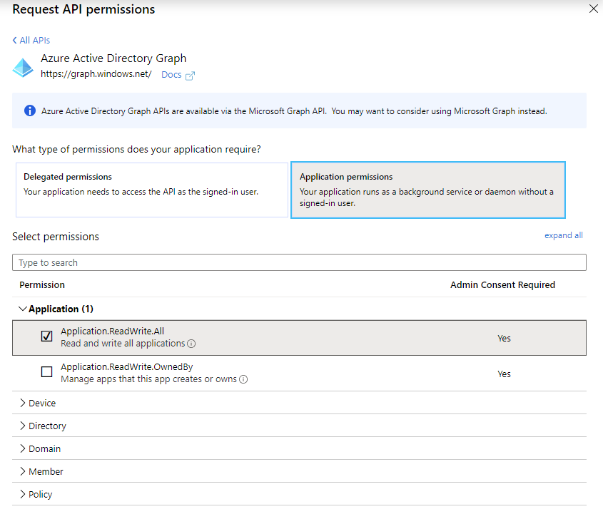

This quickstart is based on [End-to-End Pipeline Example on Azure](https://www.kubeflow.org/docs/azure/azureendtoend/) from the Kubeflow documentation.

The bundle creates the following Azure resources:
- Azure Kubernetes Service (AKS) cluster
- Azure Machine Learning Workspace
- Azure Container Registry (ACR) instance

The bundle also creates a service principal (in Azure Active Directory) that will be used by Kubeflow. Because of this, the service principal used as the credentials for the bundle must itself have permissions to create new service principals in the AAD tenant. See section below on how to set up this service principal.

After creating the Azure resources and service principal, the bundle will install Kubeflow onto the AKS cluster.

It then sets up and runs an example ML pipeline (for recognising images of tacos vs. burritos). The bundle builds container images from the Kubeflow examples repo and publishes them to the ACR instance that was deployed. Finally, the Kubeflow pipeline is compiled and uploaded to Kubeflow, and a new pipeline run is triggered, using parameters based on the resources and service principal that were created as part of the installation.

The Kubeflow dashboard is exposed via a public IP that will be displayed in the output of the bundle installation (NOTE: no authentication is applied to this endpoint for this quickstart).

You can browse to the dashboard using this IP address, where you should see that the 'tacosandburritos' pipeline has been uploaded, and a pipeline run 'tacosandburritos' has been triggered.

## Setting up the service principal

In order to create other service principals, the application associated with the service principal should be granted the Azure AD Graph Application.ReadWrite.All permission. First, use an existing service principal, or create a new one using the Azure CLI:

```
az ad sp create-for-rbac -n <name-of-service-principal>
```

You can do then grant permissions to this service principal to create other service principals. Do this via the Azure Portal (as a user with AAD admin privileges).

Go to Azure Active Directory > Applications, and find the application for your service principal. Then go to the API Permissions tab and select 'Add a permission'. Select the 'Azure Active Directory Graph' API, then 'Application permissions', and then select 'Application.ReadWrite.All'.



Add the permission, then click the 'Grant admin consent for...' button.


